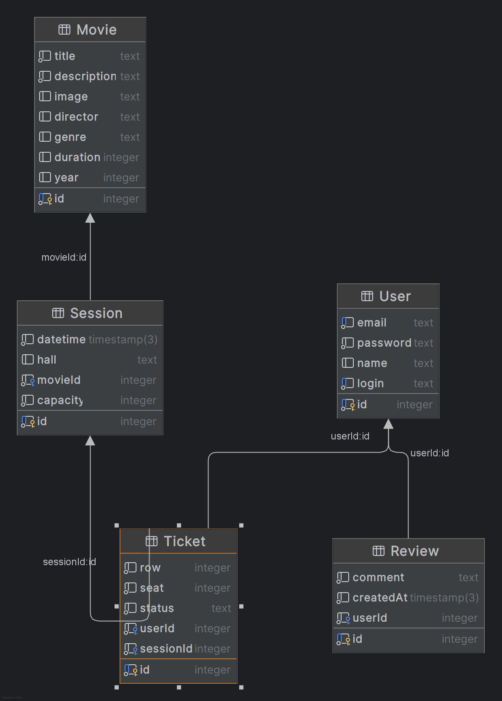

# ФИО: Белисов Иван Владимирович
# Группа: M3313

## Тема проекта
### Сайт кинотеатра
## Описание
### Сайт кинотеатра с афишей и продажей билетов: описание фильмов, жанров и новостей кино.

## Развертывание
### Ссылка на развернутое приложение: https://m3313-belisov.onrender.com/

## Диаграмма

## Описание доменной области
### В проекте выделено 5 сущностей:

1. **User** - хранит данные аккаунта (email, password). Связан с билетами и отзывами
2. **Movie** - каталог кинокартин с описанием и ссылками на постеры
3. **Session** - связующая сущность, определяющая время показа конкретного фильма
4. **Ticket** - запись о бронировании конкретного места (row, seat) пользователем на определенный сеанс
5. **Review** - текстовая оценка фильма, оставленная авторизованным пользователем